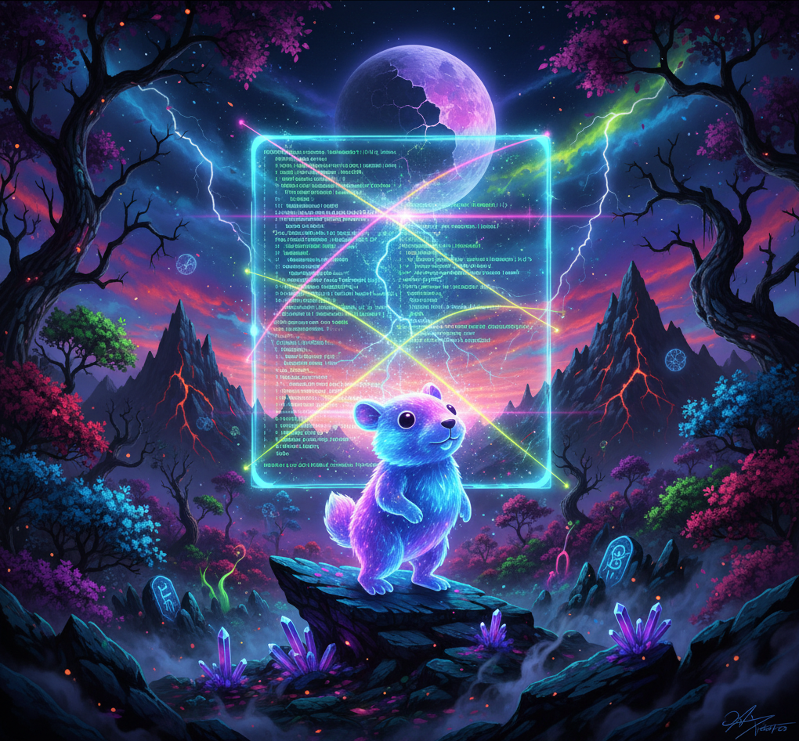

# Install Packages 26.04

  

[](https://www.ubuntu-fr.org/download/)  
  
  
[](https://golang.org/)  
[](https://www.gnu.org/software/bash/)  

## Fonctionnalités

- ✅ Interface TUI (Terminal User Interface) interactive avec [Bubble Tea](https://github.com/charmbracelet/bubbletea)
- ✅ Sélection multiple des paquets à installer
- 🛠️ Barre de progression dynamique pendant l’installation
- 🛠️ Adaptation automatique (2 ou 50 scripts — la barre s’ajuste)
- ✅ Aucun besoin de Go pour exécuter le programme final (via le binaire)

## Structure du projet
```
.  
├── cmd/  
│ └── app/  
│ └── main.go # Point d'entrée du programme  
├── ui/  
│ ├── model.go # Définition du modèle Bubble Tea  
│ ├── update.go # Logique d’interaction et installation  
│ ├── view.go # Rendu visuel (interface utilisateur)  
│ └── styles.go # Styles et couleurs (Lipgloss)  
├── scripts/ # Scripts d’installation Bash  
│ ├── install_vscode.sh  
│ ├── install_chrome.sh  
│ ├── install_burpsuite.sh  
│ └── ***
├── run.sh # Script de lancement automatique  
└── README.md  
```

## Installation

```bash
git clone https://github.com/Quirky1869/Install-Packages-26.04.git
cd Install-Packages-26.04
cp -rf scripts/ bin/install /home/$USER
cd /home/$USER
chmod u+x scripts/* install
./install
```

## Ajout de scripts

Vous pouvez si vous le souhaitez rajouter vos scripts :
- Construisez votre `install_script.sh` puis copier le dans le dossier `scripts`  
- Donner lui les droits d'exécution nécessaire
- Dans `ui/model.go` ajouter votre nom et l'emplacement de votre script (ex : "Google Chrome":      "scripts/install_chrome.sh")
- Dans `cmd/app/main.go` ajouté votre nom d'application dans le slice `items`
- Relancerle `./run.sh` pour recompiler le binaire `bin/install`
- Puis suivre la procédure [d'installation](#installation)

## Astuces
> [!TIP]
> - Appuyez sur Espace pour sélectionner/désélectionner un paquet.  
> - Appuyez sur Entrée pour lancer les installations.  
> - Appuyez sur q pour quitter à tout moment.  

## Technologies utilisées  

| Librairie                                                    | Utilisation                          |
| ------------------------------------------------------------ | ------------------------------------ |
| [Bubble Tea](https://github.com/charmbracelet/bubbletea)     | Gestion de l’interface TUI           |
| [Lipgloss](https://github.com/charmbracelet/lipgloss)        | Stylisation du texte et des bordures |
| [Bubbles/Progress](https://github.com/charmbracelet/bubbles) | Barre de progression fluide          |
| [Bash](https://www.gnu.org/software/bash/manual/bash.html)                                                       | Scripts d’installation des paquets   |

## Auteur
Projet développé par Quirky  
<a href="https://github.com/Quirky1869" target="_blank">  
   GitHub  
</a>  

## Licence
Ce projet est distribué sous licence MIT  